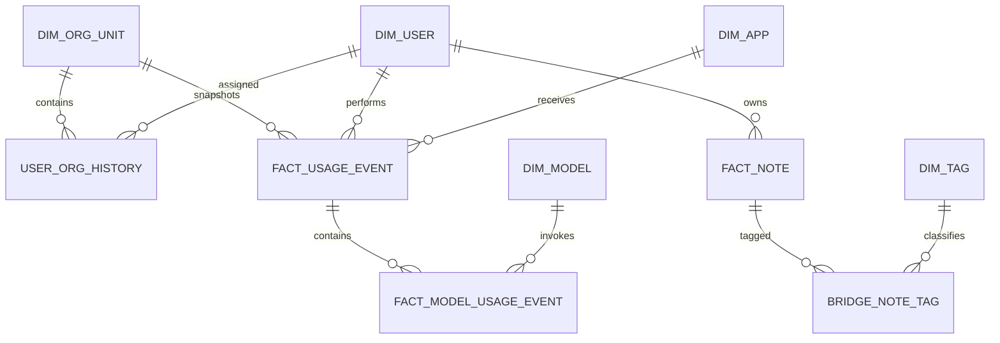

# KU GenAI Dashboard Data Design

เอกสารนี้อ้างอิงหน้าจอปัจจุบันในโปรเจกต์ และตรวจสอบ schema จริงจาก PostgreSQL
ฐาน `dify` และ `kucsgenai` เมื่อวันที่ 2026-06-29

## 1. ข้อสรุปเชิงสถาปัตยกรรม

- ใช้ `kucsgenai.user_app_usage` เป็น canonical usage event เพราะเชื่อม user และ app ได้โดยตรง
  และมี token, ราคา, THB, coin และเวลาอยู่ในแถวเดียว
- ใช้ `dify` เป็น runtime enrichment สำหรับ latency, status, error, workflow และ model invocation
  ห้ามนำ `messages`, `workflow_runs` และ `user_app_usage` มาบวกเป็น transaction รวมกันโดยตรง
  เพราะหนึ่งการใช้งานอาจปรากฏในหลายตาราง
- ใช้ `kucsgenai.apps.id -> user_app_usage.app_id` เป็นความสัมพันธ์ภายในระบบ Portal
  และใช้ `kucsgenai.apps.app_id -> dify.apps.id` เป็น cross-database mapping โดยต้องตรวจรูปแบบ UUID
  และเก็บผล mapping ไว้ใน `dim_app`
- เก็บเฉพาะ metadata ที่ Dashboard ใช้ ไม่คัดลอก prompt, answer, note content, password,
  API token, session token, email หรือข้อมูลส่วนบุคคลที่ไม่จำเป็น
- แนะนำให้ Dashboard database ใช้ PostgreSQL เพื่อรองรับ UUID, JSONB, upsert, partial index
  และชนิดข้อมูลที่ตรงกับสองฐานต้นทาง

## 2. ภาพข้อมูลจริงที่พบ

### kucsgenai

- `user`: 10,005 rows
- `apps`: 56 rows และ `app_id` ไม่ว่างทุกแถว
- `user_app_usage`: 536 rows, 46 users, 14 apps
- ช่วงข้อมูล usage: 2025-06-06 ถึง 2026-05-26
- `total_tokens`, `total_price`, `total_coins`: ครบ 536/536 rows
- `input_tokens`, `output_tokens`: มี 300/536 rows
- `total_thb`: มี 427/536 rows
- `model`: มี 534 rows แต่เป็น object ว่าง จึงไม่ควรใช้เป็นชื่อโมเดล
- `apps.model` มี key `name`, `provider`, `mode`, `completion_params`
- `usage_datas` มี cost component เช่น `llm_price`, `iteration_price`, `tavily_price`
- `user.userInfo` มี key สำหรับ campus/faculty/department แต่พบ object เพียง 2 rows
  จึงยังใช้เป็น master hierarchy ที่เชื่อถือได้ไม่ได้

### dify

- `apps`: 31 rows
- `messages`: 914 rows, 16 apps, 135 users, token/price/latency ครบทุกแถว
- `messages.model_id`: มีเพียง 2/914 rows
- `conversations`: 524 rows
- `workflow_runs`: 1,275 rows และ `total_tokens` ครบทุกแถว
- `workflow_node_executions`: 11,577 rows, เป็น LLM node 1,770 rows
- `execution_metadata`: มี 8,302 rows และมี `total_tokens`, `total_price`, `currency`
- `api_requests`: 0 rows จึงยังใช้ทำ API usage trend ไม่ได้

ข้อสังเกตสำคัญ: เวลาสูงสุดของข้อมูลที่ตรวจพบอยู่ในเดือนพฤษภาคม 2026
ระบบ sync ต้องแสดง `data_freshness` เพื่อให้ผู้ใช้รู้ว่าข้อมูลล่าสุดถึงวันใด

## 3. ข้อมูลที่ต้องดึงจากฐานต้นทาง

### จาก kucsgenai

| Source | ดึงเฉพาะ | ใช้ทำอะไร |
|---|---|---|
| `user_app_usage` | `id`, `user_id`, `app_id`, `conversation_id`, token fields, price/currency/THB/coin fields, `created_at`, `updated_at`, calculation fields | canonical transaction, active users, token, cost, trend, heatmap |
| `apps` | `id`, `app_id`, name, active, category, mode/source, `model`, timestamps, `deleted_at` | app dimension, Dify mapping, configured model |
| `app_category` | id, Thai/English name, active, timestamps | app grouping |
| `sub_category` | id, category id, Thai/English name, active, timestamps | app grouping |
| `user` | id, active, timestamps, `memberType`, เฉพาะ org key ใน `userInfo` | pseudonymous user dimension และ hierarchy |
| `ai_notes` | id, owner id, active, tags, created/updated time | total notes และ topic frequency |
| `app_team_members` | app id, user id | app owner/team filtering ในอนาคต |

ห้ามดึง `user.password`, `apps.token`, note `content`, ชื่อ, email และ username
ถ้าหน้าจอไม่ต้องแสดงข้อมูลระดับบุคคล

### จาก dify

| Source | ดึงเฉพาะ | ใช้ทำอะไร |
|---|---|---|
| `apps` | id, name, mode, status, config/workflow id, timestamps | mapping และ app runtime metadata |
| `app_model_configs` | app id, provider, model id, updated time | model fallback สำหรับ chat app |
| `messages` | ids, app/conversation/user ids, model fields, token/price fields, latency, status, error flag, timestamps | chat runtime enrichment |
| `workflow_runs` | ids, app/workflow id, status, elapsed time, total token, creator ids, timestamps | workflow runtime enrichment |
| `workflow_node_executions` | ids, run/app/node ids, node type, status, elapsed time, metadata token/price/currency, timestamps | model-level usage และ node performance |
| `conversations` | id, app id, pseudonymous user ids, status, source, dialogue count, timestamps, deleted flag | conversation mapping |
| `accounts`, `end_users` | id, app id, external user id hash, active timestamps, anonymous flag | fallback user mapping เท่านั้น |

ไม่เก็บ `messages.query`, `messages.answer`, inputs/outputs, workflow graph เต็มชุด หรือ credential ใดๆ
ใน Dashboard database

## 4. Mapping ทุกส่วนบนหน้าจอ

### Dashboard Overview

| ส่วนแสดงผล | นิยาม | Source หลัก |
|---|---|---|
| Active Users | `COUNT(DISTINCT user_key)` ของ usage ในช่วงที่เลือก | `kucsgenai.user_app_usage` |
| Token Consumption | `SUM(total_tokens)` | `kucsgenai.user_app_usage` |
| Estimated Cost | `SUM(total_thb)`; ถ้าไม่มีให้คำนวณจาก price/rate แล้วติด quality flag | `kucsgenai.user_app_usage` |
| Total Transactions | `COUNT(*)` ของ canonical usage event | `kucsgenai.user_app_usage` |
| Monthly Transaction Trends | transaction แยกตามเดือน | Dashboard `agg_usage_daily` |
| Trending Note Topics | แตก `ai_notes.tags` แล้วนับ frequency | `kucsgenai.ai_notes` |

การเปรียบเทียบกับช่วงก่อนหน้าใช้ช่วงเวลาความยาวเท่ากัน เช่น 1-30 มิ.ย. เทียบ 2-31 พ.ค.

### Consumption

| ส่วนแสดงผล | นิยาม | Source หลัก |
|---|---|---|
| Model Token Consumption | token ของ LLM node แยก model; fallback เป็น configured app model | Dify node metadata + app model config |
| Current Billing Cycle | cost ตั้งแต่ต้นเดือนถึง `data_as_of` | canonical usage |
| Projected End of Month | `MTD cost / elapsed_days * days_in_month` | Dashboard aggregate |
| Cost Efficiency | cost ต่อ 1M token เทียบช่วงก่อน | Dashboard aggregate |
| Caching Savings | แสดงได้เมื่อมี cached-token/cost field จริงเท่านั้น | ยังไม่มี source ที่ยืนยัน |
| Monthly Tokens Used 1-5 years | token รวมรายเดือนแยกปี | Dashboard `agg_usage_daily` |
| Usage by Hierarchy | token รวมตาม campus -> faculty -> department | event org snapshot |

`Caching Savings` ปัจจุบันเป็น mock และไม่ควรประมาณเป็นตัวเลขจริงจนกว่าจะพบ cached token
จาก provider response หรือเพิ่มการบันทึกในระบบต้นทาง

### Analytics

| ส่วนแสดงผล | นิยาม | Source หลัก |
|---|---|---|
| Total Transactions | canonical usage ตาม scope และ period | Dashboard fact/aggregate |
| Active Users | distinct user ตาม scope และ period | Dashboard user activity |
| Estimated Cost | THB เป็นค่าเริ่มต้น หรือเลือก currency ชัดเจน | canonical usage |
| Peak Usage Heatmap | จำนวน transaction ตาม day-of-week และ 3-hour bucket | event timestamp |
| Department Summary | token และ cost รวมตาม department/faculty | event org snapshot |
| Pagination / Export | query แบบ server-side พร้อม total count | Dashboard API |

### User Behavior

| ส่วนแสดงผล | นิยาม | Source หลัก |
|---|---|---|
| Total Notes Generated | จำนวน active notes ที่สร้างในช่วง | `kucsgenai.ai_notes` |
| Popular Conversation Tags | tags จาก notes; ชื่อหน้าจอควรเปลี่ยนเป็น Popular Note Tags | `ai_notes.tags` |
| Monthly Active Users | distinct user ต่อวัน/เดือน | Dashboard user activity |
| Top Active Apps | transaction share หรือ active-user share ต้องระบุให้ชัด | usage + `dim_app` |

## 5. Dashboard Database

### Dimension

- `dim_org_unit`: hierarchy แบบ parent-child รองรับ campus/faculty/department และ SCD Type 2
- `dim_user`: เก็บ source user id แบบ pseudonymous และสถานะเท่านั้น
- `user_org_history`: ประวัติการสังกัด เพื่อให้รายงานย้อนหลังไม่เปลี่ยน
- `dim_app`: รวม `kucsgenai.apps.id` และ `dify.apps.id` ไว้ในแถวเดียว
- `dim_model`: provider และ model name ที่ normalize แล้ว
- `dim_tag`: tag ที่ normalize แล้ว

### Fact

- `fact_usage_event`: หนึ่งแถวต่อ `kucsgenai.user_app_usage.id`; เป็นตัวนับ transaction หลัก
- `fact_model_usage_event`: หนึ่งแถวต่อ model invocation จาก Dify node/message
- `fact_note`: metadata ของ note โดยไม่เก็บ title/content
- `bridge_note_tag`: ความสัมพันธ์ note-tag
- `fact_user_activity_daily`: grain วัน + user + app + org สำหรับ active user query

### Aggregate

- `agg_usage_daily`: วัน + org + app + model สำหรับ KPI และกราฟ 5 ปี
- `agg_usage_hourly`: วัน + hour bucket + org/app สำหรับ heatmap
- `agg_topic_daily`: วัน + tag + org สำหรับ trending topics

### Operations

- `etl_run`: ประวัติรอบ sync, จำนวน read/insert/update/reject และ error
- `etl_watermark`: cursor ล่าสุดแยก source database/table
- `etl_data_quality`: coverage, duplicate, orphan mapping และ freshness

DDL เริ่มต้นอยู่ที่ `backend/database/dashboard-schema.sql`

## 6. Incremental Sync

1. เปิด connection แบบ read-only แยกสำหรับ `dify`, `kucsgenai` และ connection เขียนสำหรับ Dashboard
2. sync dimensions ก่อน: category -> subcategory -> app -> user -> organization
3. อ่านตาราง mutable ด้วย cursor `(updated_at, primary_key)` และอ่านย้อนหลังซ้ำ 10 นาที
4. อ่าน append-heavy table ด้วย `(created_at, primary_key)` และ upsert ด้วย source primary key
5. สร้าง `source_row_hash`; update เฉพาะเมื่อ hash เปลี่ยน
6. map user/app/org/model แล้วเขียน fact ใน transaction เดียวกับ watermark
7. rebuild aggregate เฉพาะ date partition ที่ได้รับผลกระทบ
8. ทำ reconciliation รายวันสำหรับ 7 วันล่าสุด และ full key reconciliation รายสัปดาห์
9. บันทึก orphan app/user/org และ null coverage ลง `etl_data_quality`
10. API ทุกหน้าต้องคืน `data_as_of`, `last_sync_status` และ `quality_warning`

ตัวอย่างรอบเวลา:

- usage/runtime: ทุก 5 นาที
- app/user/org dimension: ทุก 30 นาที
- notes/topics: ทุก 15 นาที
- reconciliation และ aggregate repair: ทุกคืน

## 7. ประเด็นที่ต้องตกลงก่อนขึ้น Production

1. แหล่ง master ของ campus/faculty/department ต้องชัดเจน เพราะ `userInfo` ปัจจุบันไม่ครอบคลุม
2. กำหนดว่า transaction หมายถึง portal usage หนึ่งแถว, conversation, message หรือ workflow run
   แบบนี้เสนอให้ใช้ portal usage หนึ่งแถว
3. กำหนดสกุลเงินหลักของ Dashboard; แนะนำ THB และเก็บ original currency/rate ไว้ตรวจสอบ
4. Model comparison ต้องยอมรับ fallback attribution สำหรับข้อมูลเก่าที่ไม่มี model invocation
5. ห้ามเปิด `DB_SYNC_ALTER` ใน production; ใช้ migration ที่ review แล้วเท่านั้น

