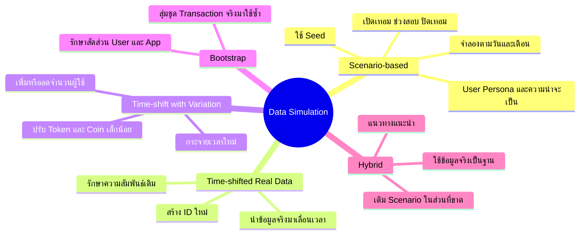

# แนวทางจำลองข้อมูลสำหรับ KU GenAI Dashboard

## เป้าหมาย

สร้างข้อมูลสำหรับทดลอง Dashboard ให้มีปริมาณเพียงพอ มีรูปแบบใกล้เคียงการใช้งานจริง และตัวเลขทุกหน้าสัมพันธ์กัน โดยไม่แก้ไขฐานข้อมูลต้นทาง `kucsgenai` และ `dify`

แนะนำให้เก็บข้อมูลจำลองในฐานแยก เช่น `kucsgenai_dashboard_demo` เพื่อไม่ให้ปะปนกับข้อมูลจริง

## Mind Map



## รูปแบบการจำลองข้อมูล

| รูปแบบ | วิธีการ | ข้อดี | ข้อควรระวัง |
|---|---|---|---|
| Scenario-based Simulation | สร้างเหตุการณ์ใหม่ตามลำดับ `User → Organization → Coin → App → Token → Usage` | ควบคุมช่วงสอบ วันหยุด และพฤติกรรมผู้ใช้ได้ | ต้องกำหนดกฎและความสัมพันธ์ให้ครบ |
| Time-shifted Real Data | สำเนาข้อมูลจริงและเลื่อนวันเวลาไปยังเดือนใหม่ | รักษารูปแบบการใช้งานจริงได้ดี | หากสำเนาตรง ๆ กราฟแต่ละเดือนจะซ้ำกัน |
| Time-shift with Variation | เลื่อนข้อมูลจริงและปรับเวลา Token, Coin หรือจำนวนผู้ใช้เล็กน้อย | สมจริงกว่าการเลื่อนเวลาอย่างเดียว | ต้องไม่ปรับจนความสัมพันธ์ทางธุรกิจเสีย |
| Bootstrap / Resampling | สุ่มเลือก Transaction จริงมาจัดเป็นชุดข้อมูลใหม่ | เพิ่มข้อมูลได้เร็วและยังรักษาการกระจายเดิม | อาจเกิดรูปแบบซ้ำเมื่อข้อมูลต้นฉบับมีน้อย |
| Hybrid | ใช้ข้อมูลจริงที่เลื่อนเวลาเป็นฐาน แล้วเติมข้อมูลจำลองเฉพาะส่วนที่ขาด | สมดุลระหว่างความสมจริงและการควบคุม | ต้องระบุให้ชัดว่าส่วนใดจริงและส่วนใดจำลอง |

## แนวทางที่เสนอ

ใช้ **Hybrid: Time-shift with Variation + Scenario-based Simulation**

```text
ข้อมูลจริงใน Data Mart
        │
        ├── เลื่อนเวลาและสร้าง ID ใหม่
        │
        ├── ปรับเวลา/ปริมาณเล็กน้อยด้วย Seed
        │
        ├── เติม User และเหตุการณ์ที่ข้อมูลจริงขาด
        │
        └── สร้าง Aggregate ใหม่จาก Fact
                    ↓
           kucsgenai_dashboard_demo
```

สัดส่วนเริ่มต้นที่เสนอ:

- 70–80% มาจากข้อมูลจริงที่เลื่อนเวลาและปรับ Variation
- 20–30% มาจาก Scenario Simulation เช่น User ใหม่ ช่วงสอบ และ App ใหม่
- ปรับสัดส่วนได้ภายหลังจากผลที่เห็นบน Dashboard

## ภาพรวมขั้นตอนการทำงาน

### ขั้นที่ 1: เตรียมฐานข้อมูล Demo

1. สร้างฐานแยก เช่น `kucsgenai_dashboard_demo`
2. ใช้ migration เดียวกับ `kucsgenai_dashboard`
3. คัดลอกเฉพาะ Dimension ที่ต้องใช้ เช่น Organization, App และ Model
4. ห้ามเขียนข้อมูลจำลองลง `kucsgenai` หรือ `dify`
5. ห้ามทดลองกับ Dashboard database ที่ใช้งานจริง

การแยกฐานทำให้สามารถลบและสร้างข้อมูลใหม่ได้โดยไม่กระทบข้อมูลจริง และทำให้ระบุได้ชัดเจนว่าข้อมูลใดเป็น Demo

### ขั้นที่ 2: กำหนด Simulation Configuration

ค่าทุกอย่างควรเก็บในไฟล์ Config แทนการเขียนค้างไว้ในโค้ด

```json
{
  "seed": 20260706,
  "sourceStart": "2026-04-01",
  "sourceEnd": "2026-05-01",
  "targetStart": "2025-08-01",
  "targetEnd": "2026-07-31",
  "newUsersPerNormalDay": 2,
  "weekdayFactor": 1.0,
  "weekendFactor": 0.35,
  "examFactor": 1.8,
  "semesterBreakFactor": 0.4,
  "tokenVariation": 0.15
}
```

`sourceEnd` ควรเป็นแบบไม่รวมวันสิ้นสุด เช่น `2026-04-01 <= event_at < 2026-05-01` เพื่อป้องกัน Record ซ้ำตรงรอยต่อเดือน

### ขั้นที่ 3: เริ่ม Transaction

Generator ควรทำงานภายใน Database Transaction:

```text
BEGIN
→ สร้าง/เลื่อน Dimension
→ สร้าง Fact Usage
→ สร้าง Fact Model Usage
→ สร้าง Note/Tag ถ้าต้องการ
→ ตรวจสอบความสัมพันธ์
→ สร้าง Aggregate
COMMIT
```

ถ้าขั้นใดผิดพลาดให้ `ROLLBACK` ทั้งรอบ เพื่อไม่ให้เหลือข้อมูลครึ่งชุด

## วิธีที่ 1: Time-shifted Real Data

วิธีนี้นำรูปแบบพฤติกรรมจริงมาเลื่อนไปยังช่วงเวลาใหม่ โดยไม่สุ่ม KPI ขึ้นมาใหม่

### 1. เลือกช่วงข้อมูลต้นแบบ

ตัวอย่าง:

```text
ช่วงต้นแบบ: 1–30 เมษายน 2026
ช่วงเป้าหมาย: 1–30 กันยายน 2025
```

ควรเลือกช่วงต้นแบบที่มีข้อมูลครบทั้ง:

- User
- App
- Usage
- Model Usage
- Organization ถ้ามี
- Note/Tag ถ้าต้องการให้หน้า User Behavior มีข้อมูล

### 2. คำนวณระยะเวลาที่ต้องเลื่อน

วิธีตรงที่สุด:

```text
timeOffset = targetStart - sourceStart
newEventTime = oldEventTime + timeOffset
```

ตัวอย่าง:

```text
oldEventTime = 2026-04-10 14:30
sourceStart  = 2026-04-01 00:00
targetStart  = 2025-09-01 00:00

เวลาภายในช่วงเดิม = 9 วัน 14 ชั่วโมง 30 นาที
newEventTime       = 2025-09-10 14:30
```

วิธีนี้รักษาระยะห่างระหว่างเหตุการณ์และเวลาในวันเดิม เหมาะกว่าการแก้เฉพาะเลขเดือน เพราะวันที่ 29–31 ไม่มีในทุกเดือน

ถ้าต้องการรักษาวันในสัปดาห์ด้วย ให้เลื่อนเป็นจำนวนสัปดาห์เต็ม หรือ map จาก “สัปดาห์ที่เท่าไร + วันอะไร + เวลาอะไร” ไปยังเดือนเป้าหมาย

### 3. ตัดสินใจก่อนว่าจะใช้ User เดิมหรือสร้าง User ใหม่

มีผลต่อความหมายของกราฟ:

- **ใช้ `user_key` เดิม:** User เดิมกลับมาใช้งานหลายเดือน เหมาะกับ Retention และ Returning User
- **สร้าง User ใหม่:** เป็นคนละกลุ่มผู้ใช้ เหมาะกับการจำลอง User Growth

แนวทาง Hybrid ควรใช้ User เดิมเป็นส่วนใหญ่ และสร้าง User ใหม่เฉพาะตามอัตราการเติบโตที่กำหนด

### 4. สร้าง Usage ID ใหม่และเก็บ Mapping

ห้ามคัดลอก Primary Key หรือ Unique ID เดิมมาใช้ซ้ำ

Generator ควรเก็บ mapping ชั่วคราว:

```text
old_usage_event_key → new_usage_event_key
old_source_usage_id → new_source_usage_id
old_conversation_id → new_conversation_id
```

ตัวอย่าง:

```text
Usage เดิม #105
→ Usage ใหม่ #9001
→ UUID ใหม่
→ Conversation ID ใหม่
```

Mapping นี้ใช้เชื่อม `fact_model_usage_event` กลับมาที่ Usage ใหม่ที่ถูกต้อง

### 5. คัดลอก `fact_usage_event`

สำหรับแต่ละ Usage:

1. ใช้ `user_key`, `app_key` และ `org_unit_key` ตามแผนที่กำหนด
2. สร้าง `source_usage_id` ใหม่
3. สร้าง `source_conversation_id` ใหม่
4. เลื่อน `event_at`, `source_created_at` และ `source_updated_at` ด้วย offset เดียวกัน
5. คงสัดส่วน Token, ราคา และ Coin เดิมในขั้น Time-shift
6. คำนวณ `source_row_hash` ใหม่จากค่าหลังเลื่อนเวลา
7. ใส่ flag หรือบันทึกภายนอกว่า Record นี้เป็น Synthetic

### 6. คัดลอก `fact_model_usage_event`

ต้องสร้างหลัง `fact_usage_event` เพราะต้องใช้ Usage mapping:

1. หา Usage ใหม่จาก `old_usage_event_key → new_usage_event_key`
2. สร้าง `source_event_id` ใหม่
3. เชื่อม `usage_event_key` ไปยัง Usage ใหม่
4. เลื่อน `event_at` ด้วย offset เดียวกับ Usage แม่
5. คง `app_key`, `model_key`, provider และ attribution method เดิม
6. ถ้ามีหลาย Model invocation ในหนึ่ง Usage ต้องคัดลอกทั้งชุด

ไม่ควรบังคับให้ Token ใน `fact_usage_event` เท่ากับผลรวม `fact_model_usage_event` เสมอ เพราะสองตารางอาจวัดคนละระดับ แต่ต้องรักษาสัดส่วนและความสัมพันธ์แบบเดียวกับ Record ต้นฉบับ

### 7. เลื่อน Note/Tag ถ้าต้องการ

ถ้าต้องการข้อมูลหน้า User Behavior:

1. สร้าง `source_note_id` ใหม่
2. เลื่อน `created_at` และ `source_updated_at`
3. เชื่อม Note กับ User/Organization ที่ถูกต้อง
4. ใช้ `dim_tag` เดิมได้
5. สร้าง `bridge_note_tag` สำหรับ Note ใหม่

### 8. ทำซ้ำไปยังเดือนอื่น

เมื่อใช้ข้อมูลต้นแบบหนึ่งเดือนสร้างหลายเดือน:

```text
เมษายนจริง
├── เลื่อนไปสิงหาคม
├── เลื่อนไปกันยายน
├── เลื่อนไปตุลาคม
└── เลื่อนไปพฤศจิกายน
```

แต่ละเดือนต้องใช้ namespace หรือ seed ย่อยต่างกัน เพื่อให้ UUID และ Variation ไม่ซ้ำ:

```text
monthSeed = hash(mainSeed + targetYear + targetMonth)
```

## วิธีที่ 2: Time-shift with Variation

วิธีนี้ทำต่อจาก Time-shift เพื่อไม่ให้กราฟแต่ละเดือนเหมือนกันทุกจุด

### 1. สร้าง Random Generator จาก Seed

ค่าที่สุ่มทุกค่าควรเกิดจาก:

```text
main seed + target month + original record ID
```

เมื่อใช้ Seed เดิม Record เดิมต้องได้ผลลัพธ์เดิมทุกครั้ง ช่วยให้ทดสอบและหา Bug ซ้ำได้

### 2. ปรับเวลาเล็กน้อย

ตัวอย่าง:

- เลื่อนเวลาในวัน ±30–90 นาที
- ไม่ให้เวลาหลุดออกจากวันเป้าหมายโดยไม่ตั้งใจ
- ชั่วโมงกลางวันมีโอกาสมากกว่ากลางคืน
- วันหยุดลดจำนวนเหตุการณ์ลง

ควรเลื่อน Usage และ Model event ที่เกี่ยวข้องไปด้วยกัน ไม่ใช่สุ่มเวลาแยกกัน

### 3. ปรับ Token แบบรักษาความสัมพันธ์

ตัวอย่าง Variation ±15%:

```text
variation = random(0.85, 1.15)
newInputTokens  = round(oldInputTokens × variation)
newOutputTokens = round(oldOutputTokens × variation)
newTotalTokens  = newInputTokens + newOutputTokens
```

ถ้าข้อมูลต้นฉบับไม่มี Input/Output ให้ปรับเฉพาะ Total Token และรักษา null เดิมไว้ ไม่ควรประดิษฐ์สัดส่วนโดยไม่มีเหตุผล

Model event ที่อยู่ใน Usage chain เดียวกันควรใช้ตัวคูณใกล้เคียงกัน เพื่อไม่ให้หน้า Consumption ขัดกับหน้าอื่นอย่างรุนแรง

### 4. คำนวณราคาและ Coin ใหม่

ห้ามปรับ Token แล้วคงราคาและ Coin เดิม เพราะจะทำให้ cost per token ผิด

ถ้ายังไม่มี Rate Card ที่ยืนยันแล้ว ให้คำนวณจากอัตราของ Record ต้นฉบับ:

```text
pricePerToken = oldPrice / oldTotalTokens
newPrice      = newTotalTokens × pricePerToken

coinPerToken  = oldCoin / oldTotalTokens
newCoin       = newTotalTokens × coinPerToken
```

ถ้ามี Rate Card จริง ให้ใช้ Model, Currency, Exchange Rate และ VAT ตามกฎจริงแทน

### 5. เพิ่มหรือลดจำนวนเหตุการณ์

กำหนด factor ตามปฏิทิน:

```text
วันธรรมดา             1.00
วันหยุด                0.35
ช่วงสอบ                1.80
ปิดเทอม                0.40
กิจกรรม Workshop       1.50
```

- Factor ต่ำกว่า 1: สุ่มตัด Usage บางส่วนออกทั้ง event chain
- Factor สูงกว่า 1: ทำสำเนา Usage บางส่วน พร้อม ID และเวลาใหม่ทั้ง event chain

ห้ามเพิ่มเฉพาะ Model event โดยไม่มี Usage แม่ หรือเพิ่ม Usage แต่ไม่สร้างรายละเอียด Model เมื่อข้อมูลต้นฉบับมีรายละเอียดนั้น

## วิธีที่ 3: Scenario-based Simulation

วิธีนี้ใช้เติมสิ่งที่ข้อมูลจริงไม่มี เช่น User ใหม่ การเติบโตช่วงเปิดเทอม หรือพฤติกรรมที่เปลี่ยนตามสถานการณ์

### 1. สร้าง Calendar

กำหนดสถานะของแต่ละวัน:

```text
2025-08-01 → semester_start
2025-08-20 → normal
2025-10-01 → midterm_exam
2025-12-20 → semester_break
```

แต่ละสถานะมี factor ของ User ใหม่, Active User และ Usage Frequency ต่างกัน

### 2. สร้าง User ใหม่รายวัน

จำนวน User ใหม่ควรสุ่มรอบค่าเฉลี่ยของแต่ละช่วง:

```text
เปิดเทอม       เฉลี่ย 8 คน/วัน
ช่วงปกติ       เฉลี่ย 2 คน/วัน
ช่วงสอบ        เฉลี่ย 4 คน/วัน
ปิดเทอม        เฉลี่ย 0–1 คน/วัน
```

สำหรับ User ใหม่แต่ละคน:

1. สร้าง `source_user_id` แบบ Synthetic ที่ไม่ซ้ำ
2. กำหนด Campus, Faculty และ Department ตามน้ำหนักที่ตั้งไว้
3. กำหนด Persona
4. กำหนดวันเริ่มใช้งาน
5. สร้าง `dim_user` และ `user_org_history`

### 3. กำหนด Persona

ตัวอย่าง:

| Persona | สัดส่วน | โอกาส Active ต่อวัน | จำนวน Usage เมื่อ Active |
|---|---:|---:|---:|
| Heavy | 10% | 70% | 3–8 |
| Regular | 55% | 30% | 1–4 |
| Casual | 30% | 8% | 1–2 |
| Inactive | 5% | 1% | 0–1 |

โอกาสจริงต่อวัน:

```text
dailyActiveChance
= basePersonaChance
 × weekdayOrWeekendFactor
 × academicPeriodFactor
 × onboardingFactor
```

### 4. ตัดสินใจว่า User คนใด Active

วน User ที่มีอยู่ในแต่ละวัน:

1. คำนวณ `dailyActiveChance`
2. สุ่มค่า 0–1 จาก Seed
3. ถ้าค่าสุ่มน้อยกว่าโอกาส Active ให้สร้างกิจกรรม
4. ถ้าไม่ Active ห้ามสร้าง Usage, Token หรือ Coin ของ User คนนั้นในวันนั้น

### 5. เลือก App และเวลาที่ใช้งาน

เลือก App แบบ weighted random ไม่ใช่โอกาสเท่ากันทั้งหมด:

```text
Chat Assistant      35%
Coding Assistant    25%
Research App        20%
Summarization       15%
Other                5%
```

น้ำหนักอาจต่างตาม Faculty และ Persona เช่น Coding App มีน้ำหนักสูงขึ้นสำหรับกลุ่มที่กำหนดไว้

เวลาการใช้งานควรกระจุกตัว:

```text
08:00–12:00     สูง
13:00–16:00     สูง
18:00–22:00     ปานกลาง
22:00–08:00     ต่ำ
```

### 6. สร้าง Usage

สำหรับแต่ละกิจกรรม:

1. สร้าง Usage และ Conversation ID
2. เลือก App
3. เลือกจำนวน Model invocation
4. สุ่ม Input/Output Token จาก distribution ของ App/Model
5. คำนวณ Total Token
6. คำนวณราคาและ Coin
7. ตรวจสอบ Coin balance
8. เขียน `fact_usage_event`
9. เขียน `fact_model_usage_event` ที่เชื่อมกับ Usage เดียวกัน

ไม่ควรใช้ Uniform Random กับ Token ทุก App เพราะค่าจะกระจายเรียบเกินจริง ควรใช้ distribution ที่มีค่าต่ำจำนวนมากและค่ามากเป็นบางครั้ง เช่น Log-normal หรือสุ่มจากข้อมูลจริงของ App นั้น

### 7. จำลอง Coin

ปัจจุบัน Dashboard Data Mart มี Coin consumption ใน Usage แต่ยังไม่มีตาราง ledger สำหรับ Top-up

จึงมีสองทางเลือก:

- ถ้าต้องการเพียง Coin Consumption: เก็บ Balance ไว้ภายใน Generator เพื่อควบคุมว่า User ใช้ต่อได้หรือไม่ แต่เขียนเฉพาะ Usage ลง Data Mart
- ถ้าต้องการแสดง Top-up และ Balance บน Dashboard: ต้องออกแบบ `fact_coin_transaction` เพิ่มก่อน แล้วเก็บ `topup`, `consume`, `refund` และ `adjustment`

กฎพื้นฐาน:

```text
ถ้า Coin พอ
→ สร้าง Usage
→ หัก Coin

ถ้า Coin ไม่พอ
→ เติม Coin ตามโอกาสที่กำหนด
   หรือ
→ ยกเลิก Usage
```

## วิธีที่ 4: Bootstrap / Resampling

1. แบ่งข้อมูลจริงเป็น event chain โดยมี Usage เป็นแม่
2. สุ่มเลือกทั้ง chain ไม่ใช่เลือกแต่ละตารางแยกกัน
3. เลื่อนเวลาไปยังวันเป้าหมาย
4. สร้าง ID ใหม่
5. ใช้ App, Token และ Coin distribution จาก chain เดิม
6. ทำซ้ำจนได้จำนวน Transaction ตามเป้าหมาย

วิธีนี้ทำได้เร็ว แต่ถ้าข้อมูลต้นแบบน้อย รูปแบบจะซ้ำง่าย จึงควรใช้ร่วมกับ Time Variation

## ขั้นตอน Hybrid ที่แนะนำให้นำไปพัฒนา

### Phase 1: สร้าง Baseline จากข้อมูลจริง

1. เลือกข้อมูลจริง 1–3 เดือนที่มีความสมบูรณ์ที่สุด
2. เลื่อนไปยังช่วงเวลาเป้าหมาย
3. ใช้ User/App/Model relationship เดิม
4. สร้าง ID ใหม่ทุก Fact
5. ยังไม่ปรับ Token หรือ Coin เพื่อสร้าง Baseline ที่ตรวจสอบง่าย

### Phase 2: เพิ่ม Variation

1. ปรับเวลาในวันเล็กน้อย
2. ปรับ Token ภายในช่วงที่กำหนด
3. คำนวณ Price/Coin ใหม่
4. เพิ่ม/ลด event chain ตาม Calendar factor
5. ตรวจว่าผลรวมยังสมเหตุผล

### Phase 3: เติม Scenario

1. เพิ่ม User ใหม่ช่วงเปิดเทอม
2. เพิ่ม Usage ช่วงสอบ
3. ลด Usage วันหยุดและปิดเทอม
4. เพิ่ม App launch หรือ Workshop เป็น event shock
5. เติม Organization coverage ที่ต้องการใช้ทดสอบ Filter

### Phase 4: สร้าง Aggregate ใหม่

ห้ามคัดลอกตารางเหล่านี้จากข้อมูลต้นแบบ:

- `fact_user_activity_daily`
- `agg_usage_daily`
- `agg_usage_hourly`
- `agg_topic_daily`

ให้ล้างเฉพาะ Aggregate ในฐาน Demo แล้วสร้างใหม่จาก Fact เพื่อให้:

```text
Active Users = COUNT(DISTINCT user_key)
Transactions = COUNT(fact_usage_event)
Token/Coin   = SUM จาก Fact ที่กำหนดเป็น source of truth
Heatmap      = GROUP BY วันและชั่วโมงของ event_at
```

ระบบปัจจุบันมีขั้นตอน `refreshAggregates()` ที่สร้างตารางเหล่านี้จาก Fact อยู่แล้ว ควรนำ logic เดียวกันมาใช้กับฐาน Demo

### Phase 5: ตรวจสอบข้อมูล

ตรวจอย่างน้อยดังนี้:

#### Referential Integrity

- Usage ทุกแถวอ้างถึง User/App ที่มีอยู่
- Model event ทุกแถวที่ควรมี Usage แม่ เชื่อม `usage_event_key` ถูกต้อง
- User organization อ้างถึง Organization ที่มีอยู่
- ไม่มี UUID หรือ Source ID ซ้ำ

#### Time Integrity

- ทุก `event_at` อยู่ในช่วง Simulation
- Model event ไม่เกิดก่อน Usage แม่แบบผิดธรรมชาติ
- `created_at <= updated_at`
- เหตุการณ์ใน chain เดียวกันถูกเลื่อนด้วย offset ที่สอดคล้องกัน

#### Metric Integrity

- Transaction เท่ากับจำนวน Usage
- Active Users เท่ากับจำนวน User ที่มี Usage จริง
- Coin/Token บนแต่ละหน้ามาจาก source of truth ที่กำหนดไว้
- Aggregate รวมกลับมาแล้วตรงกับ Fact
- Filter Campus/Faculty/Department รวมกันแล้วไม่เกินยอดรวมทั้งหมด

#### Reproducibility

- ใช้ Seed เดิมแล้วได้จำนวน Record และผลรวมเดิม
- เปลี่ยน Seed แล้วรูปแบบเปลี่ยน แต่ยังผ่าน validation
- บันทึก Seed, Config, เวลาเริ่ม/จบ และจำนวน Record ของแต่ละรอบ

## โครงสร้างโปรแกรมที่เสนอ

```text
backend/
├── config/
│   └── simulation-config.json
├── scripts/
│   └── generate-demo-data.js
└── services/
    └── simulation/
        ├── seeded-random.js
        ├── calendar.js
        ├── time-shifter.js
        ├── scenario-generator.js
        ├── aggregate-refresher.js
        └── validator.js
```

ตัวอย่างคำสั่งในอนาคต:

```bash
npm --prefix backend run simulate -- --config config/simulation-config.json
```

ควรมีโหมด:

```text
--dry-run    แสดงจำนวนที่จะสร้างแต่ยังไม่เขียน Database
--validate   ตรวจข้อมูลหลังสร้าง
--reset-demo สร้างฐาน Demo ใหม่ ห้ามใช้กับฐานจริง
```

## กฎสำคัญ

- User, App, Model และ Organization ต้องอ้างอิงกันได้จริง
- หนึ่ง Usage ต้องเป็นเหตุการณ์ต้นทางของ Transaction, Token และ Coin ที่เกี่ยวข้อง
- `fact_usage_event` และ `fact_model_usage_event` ต้องเชื่อมโยงกันเมื่อเป็นการใช้งานครั้งเดียวกัน
- การเลื่อนเวลาต้องเลื่อนทุก Record ใน event chain พร้อมกัน
- Record ที่ทำสำเนาต้องมี ID ใหม่เพื่อไม่ให้ชนกับข้อมูลเดิม
- ห้ามสุ่ม KPI หรือ Aggregate แยกตามหน้า Dashboard
- Aggregate ต้องคำนวณจาก Fact หลังสร้างข้อมูลเสร็จ
- ข้อมูลจำลองต้องมีป้ายกำกับว่าเป็น `Synthetic/Demo Data`

## ตัวอย่างผลลัพธ์ที่ต้องสัมพันธ์กัน

```text
User A ใช้ App X จำนวน 3 ครั้ง
├── Active Users = 1
├── Transactions = 3
├── Token Consumption = ผลรวม Token ของทั้ง 3 ครั้ง
├── Coin Consumption = ผลรวม Coin ของทั้ง 3 ครั้ง
├── Top Apps มี App X ตามจำนวน Usage จริง
└── Heatmap แสดงวันและเวลาของทั้ง 3 เหตุการณ์
```
